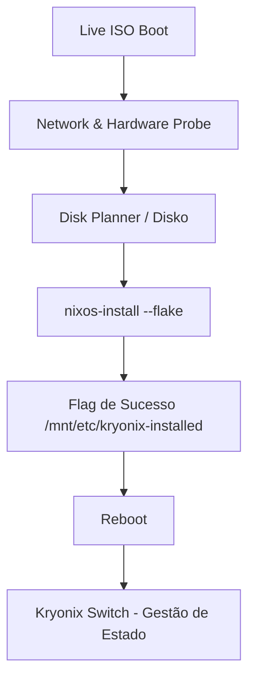

# 🌌 Kryonix: High-Performance NixOS Platform
### *Manual do Engenheiro — Versão de Operação Industrial*

O Kryonix é uma plataforma NixOS de alto desempenho, projetada para estabilidade extrema, observabilidade nativa e cargas de trabalho críticas (Gaming, Desenvolvimento e IA). Este repositório segue o princípio da **Verdade Operacional**: todo estado é declarativo, reproduzível e validado por testes automatizados.

---

## 🚀 Quick Start (Usuários de ISO)

Se você acabou de dar boot na Live ISO do Kryonix:

1.  **Conectividade**: O sistema tenta DHCP automático via Ethernet. Para WiFi, utilize a interface gráfica ou `nmcli` no terminal.
2.  **Hardware Discovery**: O backend executa o `hardware-probe` automaticamente para identificar CPUs, GPUs e armazenamento disponível.
3.  **Seleção de Fluxo**:
    *   **Modo Recomendado**: Instalação limpa com particionamento BTRFS otimizado.
    *   **Modo de Restauração**: Recuperação de sistemas Kryonix existentes.
4.  **Finalização**: Clique em "Finalizar Instalação" para disparar o motor de particionamento (Disko) e o `nixos-install`.
5.  **Primeiro Boot**: Após o reboot, utilize a CLI `kryonix` para gerenciar atualizações e perfis.

---

## 🏗️ Arquitetura de Instalação

O pipeline de implantação do Kryonix é orquestrado por um motor em Rust (`kryonix-installer`) e uma interface React.



1.  **Provisionamento**: O `disko` cria as tabelas GPT, subvolumes BTRFS e pontos de montagem em `/mnt`.
2.  **Implantação**: O `nixos-install` copia as closures diretamente da Flake local em `/etc/kryonixos`.
3.  **Gestão Post-Install**: Após o boot, o comando `kryonix switch` torna-se a fonte única de mutação do sistema, garantindo que o hardware reflita exatamente o que está no Git.

---

## 💾 Gestão de Armazenamento

O particionamento é puramente declarativo. Abaixo, a comparação técnica dos perfis de disco:

| Atributo | Modo Recomendado (BTRFS) | Modo Manual |
| :--- | :--- | :--- |
| **Filesystem** | BTRFS com Compressão ZSTD (v3) | Definido pelo usuário (Ext4/XFS) |
| **Hierarquia** | Subvolumes: `@`, `@home`, `@nix`, `@log` | Ponto de montagem raiz (`/`) obrigatório |
| **Estratégia** | Otimizada para longevidade de SSD/NVMe | Intervenção mínima do motor |
| **Resiliência** | Snapshots atômicos e COW habilitado | Gestão manual de integridade |
| **Mount Options** | `compress=zstd,noatime,ssd` | Padrões do kernel |

---

## 🛡️ Modo de Restauração (State Awareness)

O instalador é "consciente" do estado atual dos discos. Ele detecta instalações anteriores via:
- Labels de partição: `NIXOS-SYSTEM` e `NIXOS-HOME`.
- Arquivo de flag: `/mnt/etc/kryonix-installed`.
- Estrutura Git: Presença de `flake.lock` em diretórios de configuração conhecidos.

**Vantagem**: Ao selecionar a restauração, o sistema pula a formatação destrutiva e utiliza os subvolumes existentes, permitindo reinstalar o SO ou trocar de host sem perder os dados do usuário em `/home`.

---

## 🔧 Gerenciamento de Perfis

O Kryonix utiliza um sistema de perfis modulares que podem ser ativados via `patching` declarativo no `flake.nix` do host.

### Perfis Disponíveis:
- **Gamer**: Kernel zen/low-latency, `gamemode`, Steam e otimizações de scheduler.
- **Dev-Rust**: Toolchain completa (cargo, rustc, analyzer, clippy) pré-configurada.

### Ativação Manual (Exemplo):
No arquivo `/etc/kryonixos/hosts/<host>/default.nix`:
```nix
{ inputs, ... }: {
  imports = [
    inputs.kryonix.nixosModules.profile-gamer
    inputs.kryonix.nixosModules.profile-dev-rust
  ];
}
```

---

## 🛠️ Desenvolvimento e Testes

Para garantir que a ISO nunca quebre, utilizamos um ambiente de virtualização automatizado.

### Teste de Boot em VM (QEMU/KVM)
O script de teste emula o hardware real, carrega a ISO e valida a API do instalador.

```bash
# 1. Build da ISO (Gera o artefato .iso)
kryonix build iso

# 2. Executa a validação em sandbox
./scripts/test-iso-boot.sh
```

**O que o script valida**:
- Bootabilidade UEFI.
- Disponibilidade da API Axum (Porta 8080).
- Integridade do sistema de arquivos live.

---

## 📊 Observabilidade e Telemetria

Toda instância Kryonix reporta sua identidade técnica em `/etc/kryonix-version`.
- **Conteúdo**: Commit Hash, Build Timestamp e Pretty Name.
- **Telemetria**: Ping semanal anônimo para `telemetry.kryonix.org` (opcional e desativado por padrão) para mapeamento de compatibilidade de hardware.

---

**Equipe Kryonix** | *Reprodutibilidade não é um desejo, é o padrão.*
