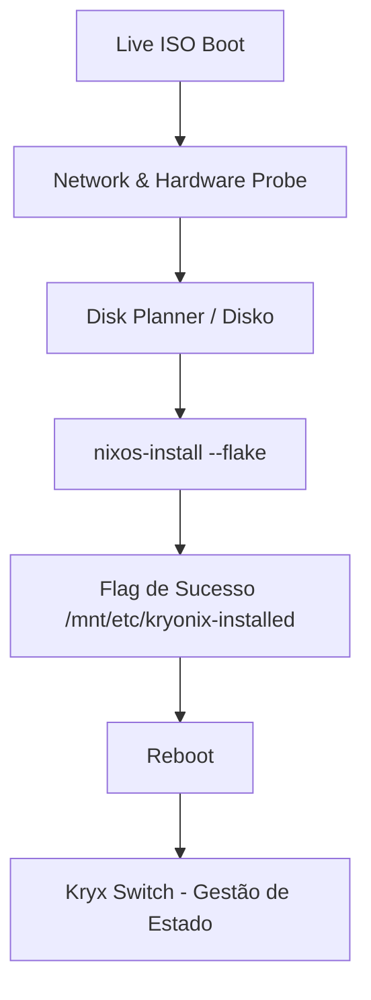

# 🌌 Kryonix: High-Performance NixOS Platform
### *Manual do Engenheiro — Versão de Operação Industrial*

O Kryonix é uma plataforma NixOS de alto desempenho, projetada para estabilidade extrema, observabilidade nativa e cargas de trabalho críticas (Gaming, Desenvolvimento e IA). Este repositório segue o princípio da **Verdade Operacional**: todo estado é declarativa, reproduzível e validado por testes automatizados.

---

## 🚀 Quick Start (Usuários de ISO)

Se você acabou de dar boot na Live ISO do Kryonix:

1.  **Conectividade**: O sistema tenta DHCP automático via Ethernet. Para WiFi, utilize a interface gráfica ou `nmcli` no terminal.
2.  **Hardware Discovery**: O backend executa o `hardware-probe` automaticamente para identificar CPUs, GPUs e armazenamento disponível.
3.  **Seleção de Fluxo**:
    *   **Modo Recomendado**: Instalação limpa com particionamento BTRFS otimizado.
    *   **Modo de Restauração**: Recuperação de sistemas Kryonix existentes.
4.  **Finalização**: Clique em "Finalizar Instalação" para disparar o motor de particionamento (Disko) e o `nixos-install`.
5.  **Primeiro Boot**: Após o reboot, utilize a CLI `kryx` (ou `kryonix`) para gerenciar atualizações e perfis.

---

## 🏗️ Arquitetura de Instalação

O pipeline de implantação do Kryonix é orquestrado por um motor em Rust (`kryxd`) e uma interface React.



1.  **Provisionamento**: O `disko` cria as tabelas GPT, subvolumes BTRFS e pontos de montagem em `/mnt`.
2.  **Implantação**: O `nixos-install` copia as closures diretamente da Flake local em `/etc/kryonixos`.
3.  **Gestão Post-Install**: Após o boot, o comando `kryx switch` torna-se a fonte única de mutação do sistema, garantindo que o hardware reflita exatamente o que está no Git.

---

## 💾 Gestão de Armazenamento

O particionamento é puramente declarativo. Abaixo, a comparação técnica dos perfis de disco:

| Atributo | Modo Recomendado (BTRFS) | Modo Manual |
| :--- | :--- | :--- |
| **Filesystem** | BTRFS com Compressão ZSTD (v3) | Definido pelo usuário (Ext4/XFS) |
| **Hierarquia** | Subvolumes: `@`, `@home`, `@nix`, `@log` | Ponto de montagem raiz (`/`) obrigatório |
| **Estratégia** | Otimizada para longevidade de SSD/NVMe | Intervenção mínima do motor |
| **Resiliência** | Snapshots atômicos e COW habilitado | Gestão manual de integridade |
| **Mount Options** | `compress=zstd,noatime,ssd` | Padrões do kernel |

---

## 🛡️ Modo de Restauração (State Awareness)

O instalador é "consciente" do estado atual dos discos. Ele detecta instalações anteriores via:
- Labels de partição: `NIXOS-SYSTEM` e `NIXOS-HOME`.
- Arquivo de flag: `/mnt/etc/kryonix-installed`.
- Estrutura Git: Presença de `flake.lock` em diretórios de configuração conhecidos.

**Vantagem**: Ao selecionar a restauração, o sistema pula a formatação destrutiva e utiliza os subvolumes existentes, permitindo reinstalar o SO ou trocar de host sem perder os dados do usuário em `/home`.

---

## 🔧 Gerenciamento de Perfis

O Kryonix utiliza um sistema de perfis modulares que podem ser ativados via `patching` declarativo no `flake.nix` do host.

### Features Disponíveis (Exemplos):
- **Gaming**: Stack completo de gaming (`steam`, `lutris`, `gamemode`, `mangohud`, etc). *Nota: a feature legada `gamer` / `profile-gamer` foi descontinuada e substituída pela canônica `gaming`.*
- **Development**: Stack modular de desenvolvimento (`rust`, `python`, `nix`, etc).

### Ativação Manual (Exemplo):
No arquivo `/etc/kryonixos/hosts/<host>/default.nix`:
```nix
{ config, lib, pkgs, ... }: {
  # Ativando features canônicas
  kryonix.features.gaming.enable = true;
  kryonix.features.development.enable = true;
  kryonix.features.development.languages.rust.enable = true;
}
```

---

## 🛠️ Desenvolvimento e Testes

Para garantir que a ISO nunca quebre, utilizamos um ambiente de virtualização automatizado.

### Teste de Boot em VM (QEMU/KVM)
O script de teste emula o hardware real, carrega a ISO e valida a API do instalador.

```bash
# 1. Build da ISO (Gera o artefato .iso)
kryx build iso

# 2. Executa a validação em sandbox
./scripts/test-iso-boot.sh
```

**O que o script valida**:
- Bootabilidade UEFI.
- Disponibilidade da API Axum (Porta 8080).
- Integridade do sistema de arquivos live.

---

## 📊 Observabilidade e Telemetria

Toda instância Kryonix reporta sua identidade técnica em `/etc/kryonix-version`.
- **Conteúdo**: Commit Hash, Build Timestamp e Pretty Name.
- **Telemetria**: Ping semanal anônimo para `telemetry.kryonix.org` (opcional e desativado por padrão) para mapeamento de compatibilidade de hardware.

---

## 📚 Catálogo de Features

A lista oficial de features canônicas (como `desktop`, `gaming`, `virtualization`, etc) e seus estados de migração está documentada no nosso Vault de arquitetura:
[Catálogo de Features do Kryonix](https://github.com/RAGton/kryonix-vault/blob/main/02-Areas/Kryonix/canonical/EXISTING_FEATURES_CATALOG.md)

---

## 🗺️ Mapa da Documentação

A documentação canônica do Kryonix vive no **Vault Obsidian**
(`github:RAGton/kryonix-vault`), sob `02-Areas/Kryonix/canonical/`. Os links
abaixo apontam para os arquivos reais (os antigos `docs/*.md` foram
consolidados no vault):

- **[Estado Atual](https://github.com/RAGton/kryonix-vault/blob/main/02-Areas/Kryonix/kryonix-meta/CURRENT_STATE.md):** O que está implementado, o que é parcial e o que está quebrado.
- **[Roadmap](https://github.com/RAGton/kryonix-vault/blob/main/02-Areas/Kryonix/kryonix-meta/ROADMAP.md):** Planejamento de futuras versões.
- **[Arquitetura](https://github.com/RAGton/kryonix-vault/blob/main/02-Areas/Kryonix/canonical/Architecture.md):** Como as peças se encaixam dentro do engine.
- **[Operações](https://github.com/RAGton/kryonix-vault/blob/main/02-Areas/Kryonix/canonical/Operations.md):** Como rodar, testar e fazer build.
- **[Segurança](https://github.com/RAGton/kryonix-vault/blob/main/02-Areas/Kryonix/canonical/Security.md):** Políticas de secrets, MCP e diretrizes de hardening.
- **[Usage / CLI](https://github.com/RAGton/kryonix-vault/blob/main/02-Areas/Kryonix/canonical/Usage.md):** Referência de comandos da CLI `kryx`/`kryonix`.

> A wiki GitHub (`github:RAGton/kryonix/wiki`) é a porta de entrada amigável
> para humanos; o vault é a fonte canônica para agentes e decisões.

## 📂 Diretórios Principais do Engine

- `modules/`: Módulos base do NixOS e Home Manager.
- `features/`: Combinações de alto nível (ex: `ai.nix`, `gaming.nix`).
- `profiles/`: Arquétipos de uso (ex: `glacier-ai.nix`, `laptop.nix`).
- `packages/`: Pacotes empacotados pelo Kryonix (ex: `kryonix-brain-lightrag`, `kryonix-cli`).
- `desktop/`: Configurações de ambiente gráfico (KDE Plasma 6 — migração de Hyprland/Caelestia em coexistência).
- `hosts/`: Definições básicas e a ISO do instalador.

## 🧩 Sub-repositórios do ecossistema

O Kryonix é uma meta-distro dividida em múltiplos repos (ver `_Sidebar` da wiki):

- `kryonix` (este) — motor / engine (módulos, features, ISO).
- `kryxd` — installer daemon (Axum + React/Vite) + capability registry.
- `kryx-cli` — CLI unificada (`kryx`) de runtime.
- `kryonixos` — instância downstream (hosts reais: glacier, inspiron, inspiron-nina).
- `kryonix-vault` — cérebro Obsidian (RAG/CAG), fonte canônica de docs.
- `kryonix-assets` — marca, boot (Plymouth), SDDM, wallpapers.
- `kryonix-brain-lightrag` — pacote Python de RAG via grafo.
- `kryonix-aura` — agente Aura (launcher/provider).
- `kryonix-home` — ferramenta Rust de autopilot do Home Manager.

---

**Equipe Kryonix** | *Reprodutibilidade não é um desejo, é o padrão.*
