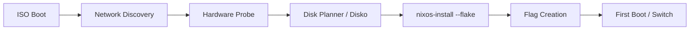

# 🌌 Kryonix: High-Performance NixOS Platform

Kryonix is a professional-grade NixOS distribution designed for stability, observability, and high-performance workloads (Gaming, Development, AI). It follows the principle of **Operational Truth**, where every state is declarative, reproducible, and validated.

---

## 🚀 Quick Start (ISO Users)

If you have just booted the Kryonix Live ISO:

1.  **Network Setup**: Connect via Ethernet (auto-DHCP) or use the UI to scan and connect to WiFi.
2.  **Hardware Discovery**: The system automatically runs `hardware-probe` to inventory your CPU, GPU, and Storage.
3.  **Deployment**: Choose between **Recommended** (fresh install) or **Restore** (recovery of existing setup) modes.
4.  **Finalize**: Click "Finalize Installation" to trigger Disko partitioning and `nixos-install`.
5.  **Reboot**: Once finished, remove the USB drive and boot into your new Kryonix environment.

---

## 🏗️ Installation Architecture

The Kryonix installation process is a multi-stage pipeline orchestrated by a Rust-based backend and a React frontend.



1.  **Pre-flight**: The backend inventory hardware and checks for existing Kryonix signatures.
2.  **Provisioning**: `disko` handles GPT tables, BTRFS subvolumes, and mount points.
3.  **Deployment**: `nixos-install` pulls the closure directly from the local flake checkout in `/etc/kryonix`.
4.  **Finalization**: A success flag is created at `/mnt/etc/kryonix-installed` to prevent accidental re-partitions on future boots.

---

## 💾 Storage Management

Kryonix uses **Disko** for declarative partitioning. Below is a comparison of the available modes:

| Feature | Recommended (BTRFS) | Manual Mode |
| :--- | :--- | :--- |
| **Filesystem** | BTRFS with ZSTD Compression | User Defined (Ext4/XFS/BTRFS) |
| **Subvolumes** | `@`, `@home`, `@nix`, `@log` | Root (`/`) only required |
| **Strategy** | Optimized for SSD/NVMe longevity | Minimal intervention |
| **Encryption** | Optional LUKS2 (Planned) | Pre-existing LUKS supported |
| **Data Safety** | Automatic snapshots ready | Manual management |

---

## 🛡️ Restore Mode

The installer is designed with **State Awareness**. It scans block devices for:
- Labels matching `NIXOS-SYSTEM`.
- Existence of `/mnt/etc/kryonix-installed`.
- Existing `flake.lock` in known repository paths.

**How to use it**: If a previous system is detected, the "Restore Mode" banner appears. Selecting it will skip the formatting phase and directly proceed to the `nixos-install` stage, effectively repairing or upgrading the existing system without losing data in `/home`.

---

## 🔧 Profile Management

Kryonix uses a **modular profile system**. You can toggle high-level system behaviors by patching the `imports` in your host's `default.nix`.

### Available Modules:
- **Gamer**: Optimizes kernel parameters for low latency, adds `gamemode`, and Steam.
- **Dev-Rust**: Pre-configures a full Rust toolchain (rustc, cargo, rust-analyzer).

### Activation Example:
In `/etc/kryonixos/hosts/<hostname>/default.nix`:
```nix
{ inputs, ... }: {
  imports = [
    inputs.kryonix.nixosModules.profile-gamer
    inputs.kryonix.nixosModules.profile-dev-rust
  ];
}
```

---

## 🛠️ Development & Validation

To ensure stability, developers must validate changes using the automated VM testing suite.

### Running the Boot Test
Requires `qemu-system-x86_64` and `KVM` enabled.

```bash
# 1. Build the ISO
kryonix build iso

# 2. Run the automated boot test
./scripts/test-iso-boot.sh
```

The script will spawn a QEMU instance, forward the API port (`8080`), and wait for a successful `/health` response from the installer backend.

---

## 📊 Observability

Every Kryonix installation includes a dedicated observability module:
- **Path**: `/etc/kryonix-version`
- **Contents**: Commit Hash, Build Timestamp, and Pretty Name.
- **Telemetry**: Optional weekly ping to `telemetry.kryonix.org` (disabled by default) to help us improve hardware compatibility.

---

**Kryonix Team** | *Reproducibility is not an option, it's the standard.*
